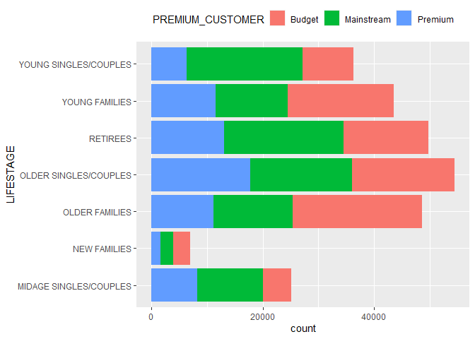
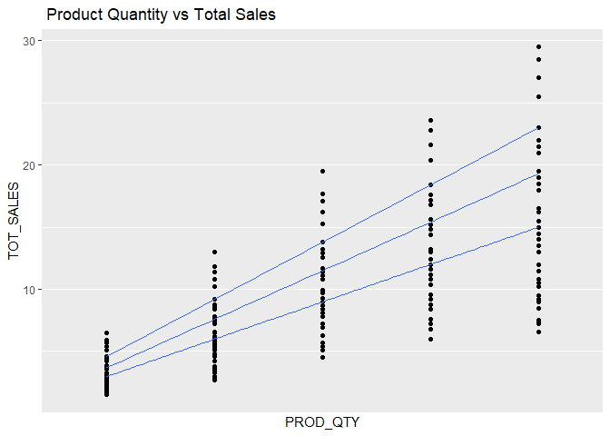
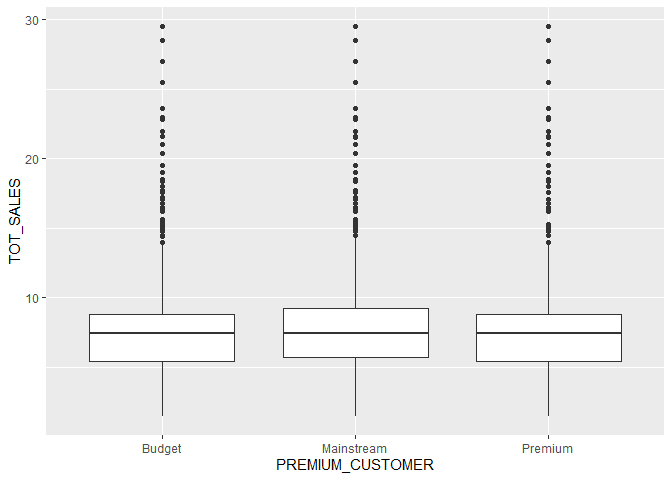
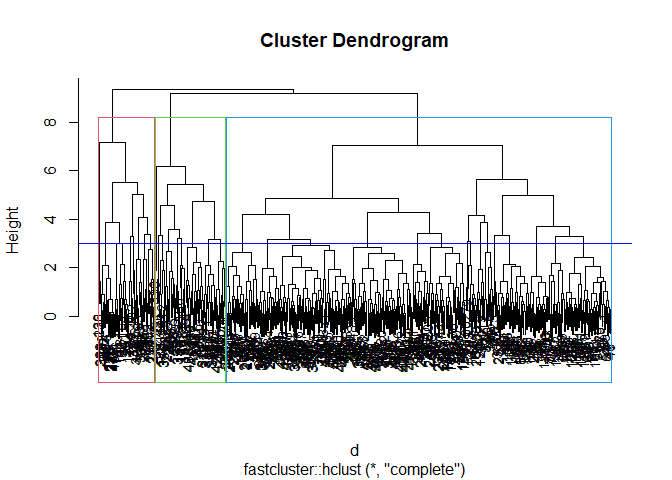

The Supermarket’s Strategic Plan for the Chip Category
================
Jose Alberto
03/11/2021

``` r
rm(list=ls(all=TRUE))
```

Load Packages:

``` r
library(rmarkdown)
library(htmltools)
library(tidyverse)
library(dplyr)
library(plyr)
library(stringr)
library(openxlsx)
library(lubridate)
library(ggplot2)
library(GGally)
library(fpp2)
library(stats)
library(fastcluster)
library(stringdist)
```

Load datasets

``` r
customers_transaction_dataset <- read.csv2("datasets/QVI_transaction_data.csv",
                                           sep =";",
                                           na.strings = "")
```

``` r
customers_purchase_dataset <- read.csv("datasets/QVI_purchase_behaviour.csv",
                                       sep = ",",
                                       na.strings = "")
```

## Data exploration

``` r
customers_transaction_dataset %>% glimpse()
```

    ## Rows: 264,836
    ## Columns: 8
    ## $ ï..DATE        <int> 43390, 43599, 43605, 43329, 43330, 43604, 43601, 43601,~
    ## $ STORE_NBR      <int> 1, 1, 1, 2, 2, 4, 4, 4, 5, 7, 7, 8, 9, 13, 19, 20, 20, ~
    ## $ LYLTY_CARD_NBR <int> 1000, 1307, 1343, 2373, 2426, 4074, 4149, 4196, 5026, 7~
    ## $ TXN_ID         <int> 1, 348, 383, 974, 1038, 2982, 3333, 3539, 4525, 6900, 7~
    ## $ PROD_NBR       <int> 5, 66, 61, 69, 108, 57, 16, 24, 42, 52, 16, 114, 15, 92~
    ## $ PROD_NAME      <chr> "Natural Chip        Compny SeaSalt175g", "CCs Nacho Ch~
    ## $ PROD_QTY       <int> 2, 3, 2, 5, 3, 1, 1, 1, 1, 2, 1, 5, 2, 1, 1, 1, 4, 1, 1~
    ## $ TOT_SALES      <dbl> 6.0, 6.3, 2.9, 15.0, 13.8, 5.1, 5.7, 3.6, 3.9, 7.2, 5.7~

``` r
str(customers_purchase_dataset)
```

    ## 'data.frame':    72637 obs. of  3 variables:
    ##  $ LYLTY_CARD_NBR  : int  1000 1002 1003 1004 1005 1007 1009 1010 1011 1012 ...
    ##  $ LIFESTAGE       : chr  "YOUNG SINGLES/COUPLES" "YOUNG SINGLES/COUPLES" "YOUNG FAMILIES" "OLDER SINGLES/COUPLES" ...
    ##  $ PREMIUM_CUSTOMER: chr  "Premium" "Mainstream" "Budget" "Mainstream" ...

``` r
dim(customers_transaction_dataset)
```

    ## [1] 264836      8

``` r
dim(customers_purchase_dataset)
```

    ## [1] 72637     3

Checking missing values

``` r
sapply(customers_transaction_dataset, function(x) sum(is.na(x)))
```

    ##        ï..DATE      STORE_NBR LYLTY_CARD_NBR         TXN_ID       PROD_NBR 
    ##              0              0              0              0              0 
    ##      PROD_NAME       PROD_QTY      TOT_SALES 
    ##              0              0              0

``` r
colSums(is.na(customers_purchase_dataset))
```

    ##   LYLTY_CARD_NBR        LIFESTAGE PREMIUM_CUSTOMER 
    ##                0                0                0

### Data cleaning is the process of preparing data for analysis

``` r
customers_transaction_dataset$ï..DATE <-  convertToDateTime(customers_transaction_dataset$ï..DATE, origin = "1900-01-01")
```

``` r
customers_transaction_dataset$ï..DATE <- as.Date(customers_transaction_dataset$ï..DATE, origin = "1900-01-01")
```

``` r
class(customers_transaction_dataset$ï..DATE)
```

    ## [1] "Date"

``` r
Stringsextract <- function(string){
  unlist(str_extract(string,regex("\\b[A-z ]*[[:punct:]]*[[:alpha:]]* [[:upper:]]*[[:lower:]]*[[:alpha:]]*")))
}
```

``` r
customers_transaction_dataset["PRODUCT_NAME"] <- 
  Stringsextract(customers_transaction_dataset$PROD_NAME)
```

``` r
unique(customers_transaction_dataset$PROD_NAME)
```

    ##   [1] "Natural Chip        Compny SeaSalt175g"  
    ##   [2] "CCs Nacho Cheese    175g"                
    ##   [3] "Smiths Crinkle Cut  Chips Chicken 170g"  
    ##   [4] "Smiths Chip Thinly  S/Cream&Onion 175g"  
    ##   [5] "Kettle Tortilla ChpsHny&Jlpno Chili 150g"
    ##   [6] "Old El Paso Salsa   Dip Tomato Mild 300g"
    ##   [7] "Smiths Crinkle Chips Salt & Vinegar 330g"
    ##   [8] "Grain Waves         Sweet Chilli 210g"   
    ##   [9] "Doritos Corn Chip Mexican Jalapeno 150g" 
    ##  [10] "Grain Waves Sour    Cream&Chives 210G"   
    ##  [11] "Kettle Sensations   Siracha Lime 150g"   
    ##  [12] "Twisties Cheese     270g"                
    ##  [13] "WW Crinkle Cut      Chicken 175g"        
    ##  [14] "Thins Chips Light&  Tangy 175g"          
    ##  [15] "CCs Original 175g"                       
    ##  [16] "Burger Rings 220g"                       
    ##  [17] "NCC Sour Cream &    Garden Chives 175g"  
    ##  [18] "Doritos Corn Chip Southern Chicken 150g" 
    ##  [19] "Cheezels Cheese Box 125g"                
    ##  [20] "Smiths Crinkle      Original 330g"       
    ##  [21] "Infzns Crn Crnchers Tangy Gcamole 110g"  
    ##  [22] "Kettle Sea Salt     And Vinegar 175g"    
    ##  [23] "Smiths Chip Thinly  Cut Original 175g"   
    ##  [24] "Kettle Original 175g"                    
    ##  [25] "Red Rock Deli Thai  Chilli&Lime 150g"    
    ##  [26] "Pringles Sthrn FriedChicken 134g"        
    ##  [27] "Pringles Sweet&Spcy BBQ 134g"            
    ##  [28] "Red Rock Deli SR    Salsa & Mzzrlla 150g"
    ##  [29] "Thins Chips         Originl saltd 175g"  
    ##  [30] "Red Rock Deli Sp    Salt & Truffle 150G" 
    ##  [31] "Smiths Thinly       Swt Chli&S/Cream175G"
    ##  [32] "Kettle Chilli 175g"                      
    ##  [33] "Doritos Mexicana    170g"                
    ##  [34] "Smiths Crinkle Cut  French OnionDip 150g"
    ##  [35] "Natural ChipCo      Hony Soy Chckn175g"  
    ##  [36] "Dorito Corn Chp     Supreme 380g"        
    ##  [37] "Twisties Chicken270g"                    
    ##  [38] "Smiths Thinly Cut   Roast Chicken 175g"  
    ##  [39] "Smiths Crinkle Cut  Tomato Salsa 150g"   
    ##  [40] "Kettle Mozzarella   Basil & Pesto 175g"  
    ##  [41] "Infuzions Thai SweetChili PotatoMix 110g"
    ##  [42] "Kettle Sensations   Camembert & Fig 150g"
    ##  [43] "Smith Crinkle Cut   Mac N Cheese 150g"   
    ##  [44] "Kettle Honey Soy    Chicken 175g"        
    ##  [45] "Thins Chips Seasonedchicken 175g"        
    ##  [46] "Smiths Crinkle Cut  Salt & Vinegar 170g" 
    ##  [47] "Infuzions BBQ Rib   Prawn Crackers 110g" 
    ##  [48] "GrnWves Plus Btroot & Chilli Jam 180g"   
    ##  [49] "Tyrrells Crisps     Lightly Salted 165g" 
    ##  [50] "Kettle Sweet Chilli And Sour Cream 175g" 
    ##  [51] "Doritos Salsa       Medium 300g"         
    ##  [52] "Kettle 135g Swt Pot Sea Salt"            
    ##  [53] "Pringles SourCream  Onion 134g"          
    ##  [54] "Doritos Corn Chips  Original 170g"       
    ##  [55] "Twisties Cheese     Burger 250g"         
    ##  [56] "Old El Paso Salsa   Dip Chnky Tom Ht300g"
    ##  [57] "Cobs Popd Swt/Chlli &Sr/Cream Chips 110g"
    ##  [58] "Woolworths Mild     Salsa 300g"          
    ##  [59] "Natural Chip Co     Tmato Hrb&Spce 175g" 
    ##  [60] "Smiths Crinkle Cut  Chips Original 170g" 
    ##  [61] "Cobs Popd Sea Salt  Chips 110g"          
    ##  [62] "Smiths Crinkle Cut  Chips Chs&Onion170g" 
    ##  [63] "French Fries Potato Chips 175g"          
    ##  [64] "Old El Paso Salsa   Dip Tomato Med 300g" 
    ##  [65] "Doritos Corn Chips  Cheese Supreme 170g" 
    ##  [66] "Pringles Original   Crisps 134g"         
    ##  [67] "RRD Chilli&         Coconut 150g"        
    ##  [68] "WW Original Corn    Chips 200g"          
    ##  [69] "Thins Potato Chips  Hot & Spicy 175g"    
    ##  [70] "Cobs Popd Sour Crm  &Chives Chips 110g"  
    ##  [71] "Smiths Crnkle Chip  Orgnl Big Bag 380g"  
    ##  [72] "Doritos Corn Chips  Nacho Cheese 170g"   
    ##  [73] "Kettle Sensations   BBQ&Maple 150g"      
    ##  [74] "WW D/Style Chip     Sea Salt 200g"       
    ##  [75] "Pringles Chicken    Salt Crips 134g"     
    ##  [76] "WW Original Stacked Chips 160g"          
    ##  [77] "Smiths Chip Thinly  CutSalt/Vinegr175g"  
    ##  [78] "Cheezels Cheese 330g"                    
    ##  [79] "Tostitos Lightly    Salted 175g"         
    ##  [80] "Thins Chips Salt &  Vinegar 175g"        
    ##  [81] "Smiths Crinkle Cut  Chips Barbecue 170g" 
    ##  [82] "Cheetos Puffs 165g"                      
    ##  [83] "RRD Sweet Chilli &  Sour Cream 165g"     
    ##  [84] "WW Crinkle Cut      Original 175g"       
    ##  [85] "Tostitos Splash Of  Lime 175g"           
    ##  [86] "Woolworths Medium   Salsa 300g"          
    ##  [87] "Kettle Tortilla ChpsBtroot&Ricotta 150g" 
    ##  [88] "CCs Tasty Cheese    175g"                
    ##  [89] "Woolworths Cheese   Rings 190g"          
    ##  [90] "Tostitos Smoked     Chipotle 175g"       
    ##  [91] "Pringles Barbeque   134g"                
    ##  [92] "WW Supreme Cheese   Corn Chips 200g"     
    ##  [93] "Pringles Mystery    Flavour 134g"        
    ##  [94] "Tyrrells Crisps     Ched & Chives 165g"  
    ##  [95] "Snbts Whlgrn Crisps Cheddr&Mstrd 90g"    
    ##  [96] "Cheetos Chs & Bacon Balls 190g"          
    ##  [97] "Pringles Slt Vingar 134g"                
    ##  [98] "Infuzions SourCream&Herbs Veg Strws 110g"
    ##  [99] "Kettle Tortilla ChpsFeta&Garlic 150g"    
    ## [100] "Infuzions Mango     Chutny Papadums 70g" 
    ## [101] "RRD Steak &         Chimuchurri 150g"    
    ## [102] "RRD Honey Soy       Chicken 165g"        
    ## [103] "Sunbites Whlegrn    Crisps Frch/Onin 90g"
    ## [104] "RRD Salt & Vinegar  165g"                
    ## [105] "Doritos Cheese      Supreme 330g"        
    ## [106] "Smiths Crinkle Cut  Snag&Sauce 150g"     
    ## [107] "WW Sour Cream &OnionStacked Chips 160g"  
    ## [108] "RRD Lime & Pepper   165g"                
    ## [109] "Natural ChipCo Sea  Salt & Vinegr 175g"  
    ## [110] "Red Rock Deli Chikn&Garlic Aioli 150g"   
    ## [111] "RRD SR Slow Rst     Pork Belly 150g"     
    ## [112] "RRD Pc Sea Salt     165g"                
    ## [113] "Smith Crinkle Cut   Bolognese 150g"      
    ## [114] "Doritos Salsa Mild  300g"

``` r
customers_transaction_dataset$PRODUCT_NAME <-  mapvalues(customers_transaction_dataset$PRODUCT_NAME, from = c(
        "Natural Chip        Compny SeaSalt" ,  
        "CCs Nacho Cheese    " ,                
        "Smiths Crinkle Cut  Chips Chicken ",   
        "Smiths Chip Thinly  S",               
        "Kettle Tortilla ChpsHny&Jlpno Chili" , 
        "Old El Paso Salsa   Dip Tomato Mild ", 
        "Smiths Crinkle Chips Salt & Vinegar",
        "Grain Waves         Sweet Chilli ",    
       "Doritos Corn Chip Mexican Jalapeno ",  
       "Grain Waves Sour    Cream&Chives ",   
       "Kettle Sensations   Siracha Lime ",   
       "Twisties Cheese     ",                
       "WW Crinkle Cut      Chicken " ,        
       "Thins Chips Light& ",                  
       "CCs Original ",                       
       "Burger Rings ",                       
       "NCC Sour Cream & ",                    
       "Doritos Corn Chip Southern Chicken ",  
       "Cheezels Cheese Box ",                 
       "Smiths Crinkle      Original ",        
       "Infzns Crn Crnchers Tangy Gcamole ",   
       "Kettle Sea Salt     And Vinegar ",     
       "Smiths Chip Thinly  Cut Original ",    
       "Kettle Original ",                    
       "Red Rock Deli Thai  Chilli&Lime ",     
       "Pringles Sthrn FriedChicken ",         
       "Pringles Sweet&Spcy BBQ",              
       "Red Rock Deli SR    Salsa & Mzzrlla",
       "Thins Chips         Originl saltd ",   
       "Red Rock Deli Sp    Salt & Truffle",   
       "Smiths Thinly       Swt Chli",         
       "Kettle Chilli ",                       
       "Doritos Mexicana    ",
       "Smiths Crinkle Cut  French OnionDip ",
       "Natural ChipCo      Hony Soy Chckn",   
       "Dorito Corn Chp     Supreme ",         
       "Twisties Chicken",
       "Smiths Thinly Cut   Roast Chicken ",   
       "Smiths Crinkle Cut  Tomato Salsa ",
       "Kettle Mozzarella   Basil & Pesto",
       "Infuzions Thai SweetChili PotatoMix ",
       "Kettle Sensations   Camembert & Fig",
       "Smith Crinkle Cut   Mac N Cheese ",
       "Kettle Honey Soy    Chicken ",
       "Thins Chips Seasonedchicken ",
       "Smiths Crinkle Cut  Salt & Vinegar",
       "Infuzions BBQ Rib   Prawn Crackers ",
       "GrnWves Plus Btroot & Chilli",
       "Tyrrells Crisps     Lightly Salted ",
       "Kettle Sweet Chilli And Sour Cream ",
       "Doritos Salsa       Medium ",
       "Kettle ",
       "Pringles SourCream  Onion ",
       "Doritos Corn Chips  Original ",
       "Twisties Cheese     Burger ",
       "Old El Paso Salsa   Dip Chnky Tom Ht",
       "Cobs Popd Swt/Chlli ",
       "Woolworths Mild     Salsa ",
       "Natural Chip Co     Tmato Hrb&Spce ",
       "Cobs Popd Sea Salt  Chips ",
       "Smiths Crinkle Cut  Chips Chs",
       "French Fries Potato Chips ",
       "Old El Paso Salsa   Dip Tomato Med ",
       "Doritos Corn Chips  Cheese Supreme ",
       "Pringles Original   Crisps ",
       "RRD Chilli& ",
       "WW Original Corn    Chips ",
       "Thins Potato Chips  Hot & Spicy",
       "Cobs Popd Sour Crm  &Chives Chips",
       "Smiths Crnkle Chip  Orgnl Big Bag ",
       "Doritos Corn Chips  Nacho Cheese ",
       "Kettle Sensations   BBQ&Maple ",
       "WW D/Style Chip",
       "Pringles Chicken    Salt Crips ",
       "WW Original Stacked Chips ",
       "Smiths Chip Thinly  CutSalt",
       "Cheezels Cheese ",
       "Tostitos Lightly    Salted ",
       "Thins Chips Salt & ",
       "Smiths Crinkle Cut  Chips Barbecue ",
       "Cheetos Puffs ",
       "RRD Sweet Chilli & ",
       "WW Crinkle Cut      Original ",
       "Tostitos Splash Of  Lime ",
       "Woolworths Medium   Salsa ",
       "Kettle Tortilla ChpsBtroot&Ricotta ",
       "CCs Tasty Cheese    ",
       "Woolworths Cheese   Rings ",
       "Tostitos Smoked     Chipotle ",
       "Pringles Barbeque   ",
       "WW Supreme Cheese   Corn Chips ",
       "Pringles Mystery    Flavour ",
       "Tyrrells Crisps     Ched & Chives",
       "Snbts Whlgrn Crisps Cheddr&Mstrd ",
       "Cheetos Chs & Bacon",
       "Pringles Slt Vingar ",
       "Infuzions SourCream&Herbs Veg",
       "Kettle Tortilla ChpsFeta&Garlic ",
       "Infuzions Mango     Chutny Papadums ",
       "RRD Steak & ",
       "RRD Honey Soy       Chicken ",
       "Sunbites Whlegrn    Crisps Frch/Onin ",
       "RRD Salt & Vinegar",
       "Doritos Cheese      Supreme ",
       "Smiths Crinkle Cut  Snag&Sauce ",
       "WW Sour Cream &OnionStacked Chips",
       "RRD Lime & Pepper",
       "Natural ChipCo Sea  Salt & Vinegr",
       "Red Rock Deli Chikn&Garlic Aioli",
       "RRD SR Slow Rst     Pork Belly ",
       "RRD Pc Sea Salt     ",
       "Smith Crinkle Cut   Bolognese ",
       "Doritos Salsa Mild  "), 
          to = c("Natural Chip SeaSalt",
                 "CCs Nacho Cheese",
                 "Smiths Crinckle Chicken Chips",
                 "Smiths Thinly SourCream Onion",
                 "Kettle Tortilla Chips Chilli Honey Jalapeno",
                 "Old El Paso Tomato Salsa Dip Mild",
                 "Smiths Crinkle Chips Salt Vinegar",
                 "GrainWaves Sweet Chilli",
                 "Doritos Corn Chip Mexican Jalapeno",
                 "GrainWaves SourCream Chives",
                 "Kettle Sensations Sriracha Lime",
                 "Twisties Cheese",
                 "WW Crinkle Cut Chicken ",
                 "Thins Chips Light Tangy",
                 "CCs Original",
                 "Burger Rings",
                 "NCC SourCream Garden Chives",
                 "Doritos Corn Chip Southern Chicken",
                 "Cheezels Cheese Box",
                 "Smiths Crinkle Original",
                 "Infuzions Corn Crunchers Tangy Guacamole",
                 "Kettle SeaSalt Vinegar",
                 "Smiths Thinly Cut Original Chips",
                 "Kettle Original",
                 "RRD Thai Chilli Lime",
                 "Pringles Southern Fried Chicken",
                 "Pringles Sweet Spicy BBQ",
                 "RRD SR Salsa Mozzarella",
                 "Thins Chips Original Salted",
                 "RRD Sp Salt Truffle",
                 "SMITHS THINLY SWEET CHILLI SOURCREAM",
                 "Kettle Chilli",
                 "Doritos Mexicana",
                 "Smiths Crinkle French Onion Dip",
                 "Natural Chip Honey Soy Chicken",
                 "Doritos Corn Chips Cheese Supreme",
                 "Twisties Chicken",
                 "Smiths Thinly Roast Chicken",
                 "Smiths Crinkle Tomato Salsa",
                 "Kettle Mozzarella Basil Pesto",
                 "infuzions Potato Mix Thai Sweet Chilli",
                 "Kettle Sensations Camembert Fig",
                 "Smith Crinkle Mac N Cheese",
                 "Kettle Honey Soy Chicken ",
                 "Thins Chips Seasoned Chicken",
                 "Smiths Crinkle Salt Vinegar",
                 "InfuZions Prawn Crackers BBQ Rib",
                 "Grainwaves Beetroot Chilli Jam",
                 "Tyrrells Crisps Lightly Salted",
                 "Kettle Sweet Chilli SourCream",
                 "Doritos Medium Salsa",
                 "Kettle Sweet Potato SeaSalt",
                 "Pringles SourCream  Onion",
                  "Doritos Corn Chips Original",
                 "Twisties Cheese Burger",
                 "Old El Paso Chunky Hot Tomato Salsa",
                 "Cobs Popd Sweet Chilli SourCream Chips",
                 "Woolworths Mild Salsa",
                 "Natural Chip Tomato Herbs Spices",
                 "Cobs Popd SeaSalt Chips",
                 "Smiths Crinkle Cheese Onion Chips",
                 "French Fries Potato Chips",
                 "Old el Paso Med Chunky Tomato Salsa",
                 "Doritos Corn Chips Cheese Supreme",
                 "Pringles Original Crisps",
                 "RRD Chilli Coconut",
                  "WW Original Corn Chips",
                  "Thins Hot Spicy Potato Chips",
                  "Cobs Popd Chips SourCREAM CHIVES",
                 "Smiths Crnkle Chip  Orgnl Big Bag",
                 "Dorito's Nacho Cheese Corn Chips",
                  "Kettle Sensations BBQ Maple",
                  "WW Deli Style Chips SeaSalt",
                 "Pringles Chicken Salt Crips",
                 "WW Original Stacked chips",
                  "Smiths Thinly Chips Salt Vinegar",
                  "Cheezels Cheese",
                  "Tostitos Lightly Salted",
                  "Thins Chips Salt Vinegar",
                 "Smiths Chinckle Chips Barbecue",
                 "Cheetos Puffs",
                  "RRD Sweet Chilli SourCream",
                 "WW Crincle Cut original",
                 "Tostitos Splash of Lime",
                 "Wooworths Medium Salsa",
                 "Kettle Tortilla Chips Beetroot Ricotta",
                 "CCs Tasty Cheese",
                 "Woolworths Cheese Rings",
                 "Tostitos Smoked Chipotle",
                 "Pringles Barbeque",
                 "WW Supreme Cheese Corn Chips",
                 "Pringles Mystery Flavour",
                 "Tyrells Crisps Cheddar Chives",
                 "Snbts Whlgrn Crisps CheddrMstrd",
                 "Cheetos Cheese Bacon Balls",
                 "Pringles Salt Vingar",
                 "Infuzions SourCream Herbs Veg",
                 "Kettle Tortilla ChpsFeta Garlic",
                 "Infuzions Papadams Mango Chutney",
                 "RRD Steak Chimichurri",
                 "RRD Honey Soy Chicken",
                 "Sunbites Whlegrn Crisps Frch Onin",
                 "RRD Salt Vinegar",
                 "Doritos Cheese Supreme",
                 "Smiths Crinkle Cut  SnagSauce ",
                 "WW Sour Cream OnionStacked Chips",
                 "RRD Lime Pepper",
                 "Natural Chip SeaSalt Vinegr",
                 "RRD Chikn Garlic Aioli",
                 "RRD SR Slow Rst Pork Belly",
                 "RRD Pc Sea Salt",
                 "Smith Crinkle Bolognese",
                 "Doritos Salsa Mild"))
```

``` r
table(customers_transaction_dataset$PRODUCT_NAME)
```

    ## 
    ##                                Burger Rings 
    ##                                        1564 
    ##                            CCs Nacho Cheese 
    ##                                        1498 
    ##                                CCs Original 
    ##                                        1514 
    ##                            CCs Tasty Cheese 
    ##                                        1539 
    ##                  Cheetos Cheese Bacon Balls 
    ##                                        1479 
    ##                               Cheetos Puffs 
    ##                                        1448 
    ##                             Cheezels Cheese 
    ##                                        3149 
    ##                         Cheezels Cheese Box 
    ##                                        1454 
    ##            Cobs Popd Chips SourCREAM CHIVES 
    ##                                        3159 
    ##                     Cobs Popd SeaSalt Chips 
    ##                                        3265 
    ##      Cobs Popd Sweet Chilli SourCream Chips 
    ##                                        3269 
    ##            Dorito's Nacho Cheese Corn Chips 
    ##                                        3160 
    ##                      Doritos Cheese Supreme 
    ##                                        3052 
    ##          Doritos Corn Chip Mexican Jalapeno 
    ##                                        3204 
    ##          Doritos Corn Chip Southern Chicken 
    ##                                        3172 
    ##           Doritos Corn Chips Cheese Supreme 
    ##                                        6402 
    ##                 Doritos Corn Chips Original 
    ##                                        3121 
    ##                        Doritos Medium Salsa 
    ##                                        1449 
    ##                            Doritos Mexicana 
    ##                                        3115 
    ##                          Doritos Salsa Mild 
    ##                                        1472 
    ##                   French Fries Potato Chips 
    ##                                        1418 
    ##              Grainwaves Beetroot Chilli Jam 
    ##                                        1468 
    ##                 GrainWaves SourCream Chives 
    ##                                        3105 
    ##                     GrainWaves Sweet Chilli 
    ##                                        3167 
    ##    Infuzions Corn Crunchers Tangy Guacamole 
    ##                                        3144 
    ##            Infuzions Papadams Mango Chutney 
    ##                                        1507 
    ##      infuzions Potato Mix Thai Sweet Chilli 
    ##                                        3242 
    ##            InfuZions Prawn Crackers BBQ Rib 
    ##                                        3174 
    ##               Infuzions SourCream Herbs Veg 
    ##                                        3134 
    ##                               Kettle Chilli 
    ##                                        3038 
    ##                   Kettle Honey Soy Chicken  
    ##                                        3148 
    ##               Kettle Mozzarella Basil Pesto 
    ##                                        3304 
    ##                             Kettle Original 
    ##                                        3159 
    ##                      Kettle SeaSalt Vinegar 
    ##                                        3173 
    ##                 Kettle Sensations BBQ Maple 
    ##                                        3083 
    ##             Kettle Sensations Camembert Fig 
    ##                                        3219 
    ##             Kettle Sensations Sriracha Lime 
    ##                                        3127 
    ##               Kettle Sweet Chilli SourCream 
    ##                                        3200 
    ##                 Kettle Sweet Potato SeaSalt 
    ##                                        3257 
    ##      Kettle Tortilla Chips Beetroot Ricotta 
    ##                                        3146 
    ## Kettle Tortilla Chips Chilli Honey Jalapeno 
    ##                                        3296 
    ##             Kettle Tortilla ChpsFeta Garlic 
    ##                                        3138 
    ##              Natural Chip Honey Soy Chicken 
    ##                                        1460 
    ##                        Natural Chip SeaSalt 
    ##                                        1468 
    ##                 Natural Chip SeaSalt Vinegr 
    ##                                        1550 
    ##            Natural Chip Tomato Herbs Spices 
    ##                                        1572 
    ##                 NCC SourCream Garden Chives 
    ##                                        1419 
    ##         Old El Paso Chunky Hot Tomato Salsa 
    ##                                        3125 
    ##         Old el Paso Med Chunky Tomato Salsa 
    ##                                        3114 
    ##           Old El Paso Tomato Salsa Dip Mild 
    ##                                        3085 
    ##                           Pringles Barbeque 
    ##                                        3210 
    ##                 Pringles Chicken Salt Crips 
    ##                                        3104 
    ##                    Pringles Mystery Flavour 
    ##                                        3114 
    ##                    Pringles Original Crisps 
    ##                                        3157 
    ##                        Pringles Salt Vingar 
    ##                                        3095 
    ##                   Pringles SourCream  Onion 
    ##                                        3162 
    ##             Pringles Southern Fried Chicken 
    ##                                        3083 
    ##                    Pringles Sweet Spicy BBQ 
    ##                                        3177 
    ##                      RRD Chikn Garlic Aioli 
    ##                                        1434 
    ##                          RRD Chilli Coconut 
    ##                                        1506 
    ##                       RRD Honey Soy Chicken 
    ##                                        1513 
    ##                             RRD Lime Pepper 
    ##                                        1473 
    ##                             RRD Pc Sea Salt 
    ##                                        1431 
    ##                            RRD Salt Vinegar 
    ##                                        1474 
    ##                         RRD Sp Salt Truffle 
    ##                                        1498 
    ##                     RRD SR Salsa Mozzarella 
    ##                                        1458 
    ##                  RRD SR Slow Rst Pork Belly 
    ##                                        1526 
    ##                       RRD Steak Chimichurri 
    ##                                        1455 
    ##                  RRD Sweet Chilli SourCream 
    ##                                        1516 
    ##                        RRD Thai Chilli Lime 
    ##                                        1495 
    ##                     Smith Crinkle Bolognese 
    ##                                        1451 
    ##                  Smith Crinkle Mac N Cheese 
    ##                                        1512 
    ##              Smiths Chinckle Chips Barbecue 
    ##                                        1489 
    ##               Smiths Crinckle Chicken Chips 
    ##                                        1484 
    ##           Smiths Crinkle Cheese Onion Chips 
    ##                                        1481 
    ##           Smiths Crinkle Chips Salt Vinegar 
    ##                                        3197 
    ##         Smiths Crinkle Cut  Chips Original  
    ##                                        1461 
    ##              Smiths Crinkle Cut  SnagSauce  
    ##                                        1503 
    ##             Smiths Crinkle French Onion Dip 
    ##                                        1438 
    ##                     Smiths Crinkle Original 
    ##                                        3142 
    ##                 Smiths Crinkle Salt Vinegar 
    ##                                        1455 
    ##                 Smiths Crinkle Tomato Salsa 
    ##                                        1470 
    ##           Smiths Crnkle Chip  Orgnl Big Bag 
    ##                                        3233 
    ##            Smiths Thinly Chips Salt Vinegar 
    ##                                        1440 
    ##            Smiths Thinly Cut Original Chips 
    ##                                        1614 
    ##                 Smiths Thinly Roast Chicken 
    ##                                        1519 
    ##               Smiths Thinly SourCream Onion 
    ##                                        1473 
    ##        SMITHS THINLY SWEET CHILLI SOURCREAM 
    ##                                        1461 
    ##             Snbts Whlgrn Crisps CheddrMstrd 
    ##                                        1576 
    ##           Sunbites Whlegrn Crisps Frch Onin 
    ##                                        1432 
    ##                     Thins Chips Light Tangy 
    ##                                        3188 
    ##                 Thins Chips Original Salted 
    ##                                        1441 
    ##                    Thins Chips Salt Vinegar 
    ##                                        3103 
    ##                Thins Chips Seasoned Chicken 
    ##                                        3114 
    ##                Thins Hot Spicy Potato Chips 
    ##                                        3229 
    ##                     Tostitos Lightly Salted 
    ##                                        3074 
    ##                    Tostitos Smoked Chipotle 
    ##                                        3145 
    ##                     Tostitos Splash of Lime 
    ##                                        3252 
    ##                             Twisties Cheese 
    ##                                        3115 
    ##                      Twisties Cheese Burger 
    ##                                        3169 
    ##                            Twisties Chicken 
    ##                                        3170 
    ##               Tyrells Crisps Cheddar Chives 
    ##                                        3268 
    ##              Tyrrells Crisps Lightly Salted 
    ##                                        3174 
    ##                     Woolworths Cheese Rings 
    ##                                        1516 
    ##                       Woolworths Mild Salsa 
    ##                                        1491 
    ##                      Wooworths Medium Salsa 
    ##                                        1430 
    ##                     WW Crincle Cut original 
    ##                                        1410 
    ##                     WW Crinkle Cut Chicken  
    ##                                        1467 
    ##                 WW Deli Style Chips SeaSalt 
    ##                                        1469 
    ##                      WW Original Corn Chips 
    ##                                        1495 
    ##                   WW Original Stacked chips 
    ##                                        1487 
    ##            WW Sour Cream OnionStacked Chips 
    ##                                        1483 
    ##                WW Supreme Cheese Corn Chips 
    ##                                        1509

``` r
Numberextract <- function(string2){
  unlist(regmatches(string2,gregexpr("[[:digit:]]+\\.*[[:digit:]]*",string2)))
}
```

``` r
customers_transaction_dataset["Package_Weight"] <- 
  Numberextract(customers_transaction_dataset$PROD_NAME)
```

``` r
customers_transaction_dataset$Package_Weight <- 
  as.numeric(customers_transaction_dataset$Package_Weight)
```

Dropping Column

``` r
customers_transaction_dataset02 <- customers_transaction_dataset %>% select(-c(PROD_NAME))
```

Finding duplicates rows

``` r
anyDuplicated(customers_transaction_dataset02)
```

    ## [1] 124846

``` r
anyDuplicated(customers_transaction_dataset02$TXN_ID)
```

    ## [1] 43

Selecting specific rows

``` r
customers_transaction_dataset02[rownames(customers_transaction_dataset02) 
                               %in% c(40,41,42,43,124844,124845,124846),]
```

    ##           ï..DATE STORE_NBR LYLTY_CARD_NBR TXN_ID PROD_NBR PROD_QTY TOT_SALES
    ## 40     2018-08-18        55          55072  48878      107        1      2.60
    ## 41     2019-05-14        55          55072  48883      106        1      3.00
    ## 42     2019-05-20        55          55073  48887        4        1      3.25
    ## 43     2019-05-20        55          55073  48887      113        1      4.60
    ## 124844 2018-10-01       107         107024 108462       45        2      6.00
    ## 124845 2018-10-01       107         107024 108462       18        2      6.60
    ## 124846 2018-10-01       107         107024 108462       45        2      6.00
    ##                             PRODUCT_NAME Package_Weight
    ## 40       Smiths Crinkle French Onion Dip            150
    ## 41        Natural Chip Honey Soy Chicken            175
    ## 42     Doritos Corn Chips Cheese Supreme            380
    ## 43                      Twisties Chicken            270
    ## 124844       Smiths Thinly Roast Chicken            175
    ## 124845        Cheetos Cheese Bacon Balls            190
    ## 124846       Smiths Thinly Roast Chicken            175

``` r
filter(customers_transaction_dataset02,PROD_QTY >= 200) %>%
 select(STORE_NBR,LYLTY_CARD_NBR,TXN_ID,PROD_NBR,PROD_QTY) 
```

    ##   STORE_NBR LYLTY_CARD_NBR TXN_ID PROD_NBR PROD_QTY
    ## 1       226         226000 226201        4      200
    ## 2       226         226000 226210        4      200

Deleting rows :

``` r
customers_transaction_dataset02 <- customers_transaction_dataset02[
                              (customers_transaction_dataset02$PROD_QTY!=200),]
```

Removing duplicate rows in data frame:

``` r
customers_transaction_dataset02 <- distinct(customers_transaction_dataset02)
```

``` r
anyDuplicated(customers_purchase_dataset)
```

    ## [1] 0

``` r
which(customers_purchase_dataset$LYLTY_CARD_NBR==226000)
```

    ## [1] 59695

``` r
customers_purchase_dataset[c(59693,59694,59695,59696,59697),]
```

    ##       LYLTY_CARD_NBR              LIFESTAGE PREMIUM_CUSTOMER
    ## 59693         225249 MIDAGE SINGLES/COUPLES       Mainstream
    ## 59694         225250               RETIREES       Mainstream
    ## 59695         226000         OLDER FAMILIES          Premium
    ## 59696         226002  OLDER SINGLES/COUPLES           Budget
    ## 59697         226003         YOUNG FAMILIES          Premium

Dropping row :

``` r
customers_purchase_dataset <- customers_purchase_dataset %>%
                                        slice(-c(59695))
```

Merge keep all rows from both data frames:

``` r
customers_dataset_merge <- merge(x=customers_transaction_dataset02,
                                y=customers_purchase_dataset,
                                by="LYLTY_CARD_NBR",
                                all=TRUE)
```

``` r
sum(is.na(customers_dataset_merge))
```

    ## [1] 0

``` r
colnames(customers_dataset_merge)
```

    ##  [1] "LYLTY_CARD_NBR"   "ï..DATE"          "STORE_NBR"        "TXN_ID"          
    ##  [5] "PROD_NBR"         "PROD_QTY"         "TOT_SALES"        "PRODUCT_NAME"    
    ##  [9] "Package_Weight"   "LIFESTAGE"        "PREMIUM_CUSTOMER"

``` r
customers_dataset_merge <- customers_dataset_merge %>% 
                                relocate(
                                ï..DATE,PREMIUM_CUSTOMER,LIFESTAGE,LYLTY_CARD_NBR,
                                STORE_NBR,TXN_ID,PROD_NBR,PRODUCT_NAME,
                                Package_Weight,PROD_QTY,TOT_SALES)
```

``` r
customers_dataset_merge$PREMIUM_CUSTOMER <- as.factor(customers_dataset_merge$PREMIUM_CUSTOMER)
```

``` r
ggplot(data = customers_dataset_merge)+
  geom_bar(mapping = aes(x=LIFESTAGE, fill=PREMIUM_CUSTOMER)) +
  theme(legend.position = 'top')+
  coord_flip()
```

<!-- -->

``` r
sort(unique(customers_dataset_merge$TOT_SALES))
```

    ##   [1]  1.50  1.70  1.80  1.90  2.10  2.30  2.40  2.60  2.70  2.80  2.90  3.00
    ##  [13]  3.10  3.25  3.30  3.40  3.60  3.70  3.80  3.90  4.20  4.30  4.40  4.50
    ##  [25]  4.60  4.80  5.10  5.20  5.40  5.60  5.70  5.80  5.90  6.00  6.20  6.30
    ##  [37]  6.50  6.60  6.80  6.90  7.20  7.40  7.50  7.60  7.80  8.10  8.40  8.50
    ##  [49]  8.60  8.70  8.80  9.00  9.20  9.30  9.50  9.60  9.75  9.90 10.20 10.40
    ##  [61] 10.50 10.80 11.10 11.20 11.40 11.50 11.60 11.70 11.80 12.00 12.40 12.60
    ##  [73] 12.90 13.00 13.20 13.50 13.80 14.00 14.40 14.50 14.80 15.00 15.20 15.30
    ##  [85] 15.50 15.60 16.20 16.25 16.50 16.80 17.10 17.20 17.60 17.70 18.00 18.40
    ##  [97] 18.50 19.00 19.50 20.40 21.00 21.50 21.60 22.00 22.80 23.00 23.60 25.50
    ## [109] 27.00 28.50 29.50

``` r
ggplot(customers_dataset_merge, 
       aes(PROD_QTY, TOT_SALES)) + 
        geom_point()+
        geom_quantile() + 
        ggtitle(" Product Quantity vs Total Sales")+
        scale_x_discrete("PROD_QTY")+
        scale_y_continuous("TOT_SALES")
```

<!-- -->

``` r
ggplot(customers_dataset_merge, aes(PREMIUM_CUSTOMER,
                                    TOT_SALES)) + 
                                    geom_boxplot()
```

<!-- -->

Selecting 500 samples and removing some columns :

``` r
customers_dataset2_merge <- customers_dataset_merge[1:500,-c(1,2,3,8)]
```

#### Pre-processing for clustering

``` r
 customers_dataset2_merge_scaled <- scale(customers_dataset2_merge)
```

``` r
d <-  dist(x=customers_dataset2_merge_scaled, method ="euclidean")
```

``` r
distance_matrix <- as.matrix(d)
```

``` r
hc <-  fastcluster::hclust(d, method = "complete")
```

``` r
plot(hc)
```

<!-- -->

Cut into into 3 groups;

``` r
sub_groups <- cutree(hc, k=3)
```

Number of members in each cluster:

``` r
table(sub_groups)
```

    ## sub_groups
    ##   1   2   3 
    ## 376  55  69

Drawing the dendrogram with a border around the 3 clusters

``` r
plot(hc, cex = 0.9)
rect.hclust(hc, k=3, border = 2:4)
abline(h=3, col ="blue")
```

<!-- -->
